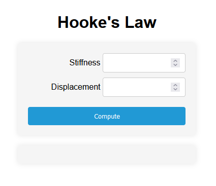
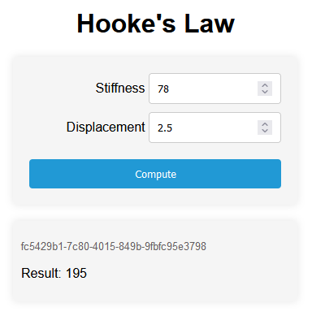

# Standalone app: Hooke's Law

## Description

Hooke's Law app is a simple Python transformation application that allows users to compute Hooke's Law based on the stiffness constant and the displacement.

This is the simplest of the standalone apps.

## How to run the app

### Inputs

When you open the app you will be presented with the following screen

Once both values have been inputted, the Force can be computed

### Results

The result is computed and shown in the same window, together with the transformation id:

