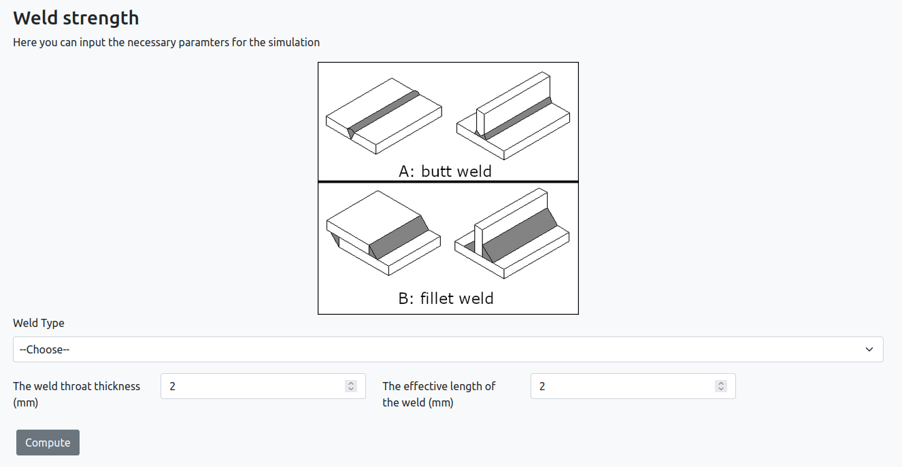
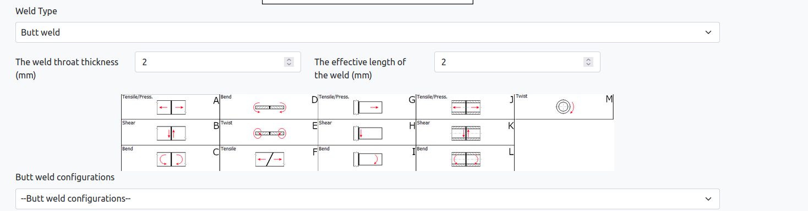
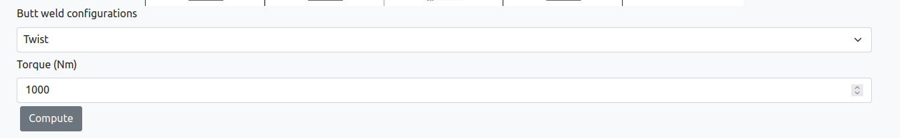
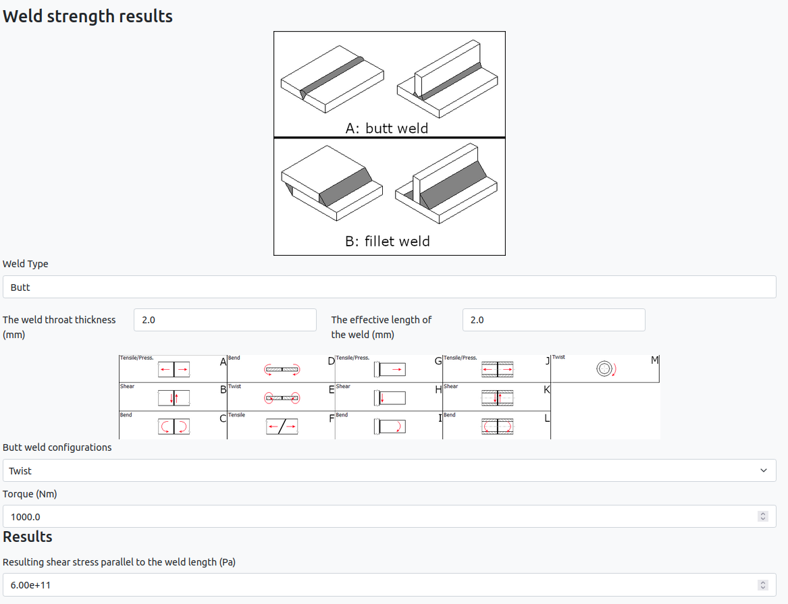
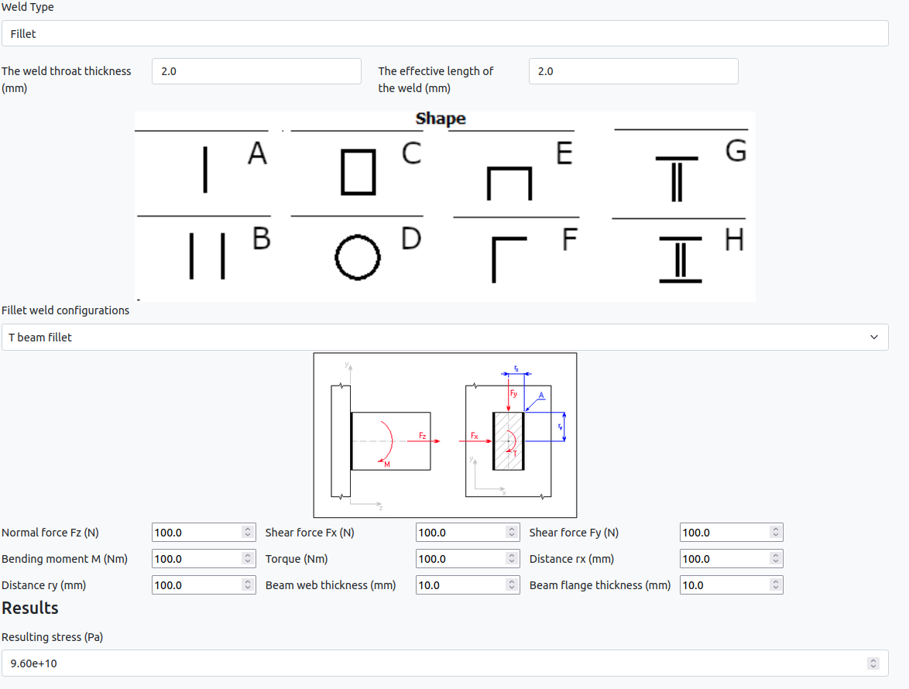

# Standalone app: Weld strength

## Description

This app calculates the strength of a weld based on user-provided parameters.
The user selects the desired weld type, and the relevant parameters such as weld throat thickness and effective length.

Depending on the selected weld type and load configuration, the function calculates and displays the corresponding stress values.

For butt welds, it considers various load scenarios such as tensile, shear, bending, and twisting.
For fillet welds, it calculates the strength based on different fillet weld configurations.

## How to run the app

### Inputs

When you open the app you will be presented with the following screen

You have to select the type of weld to calculate (butt weld or fillet weld), and you also have to provide the weld throat thickness and effective length of the weld.

Here we select the butt weld, weld throat thickness of 2 mm and effective length of the weld of 2 mm.
Once the butt weld type is selected you have to select a configuration to help you decide the app shows a image depicting the available possibilities.

As an example let's select the twist case with a torque of 1000 N.

At this point you only have to click on compute.

### Results

After processing the input, the app will present you with the results. The output will be displayed as follows:

In this screen, you have a summary of your inputs together with the resulting stress.

If in the previous section you had chosen to compute the stress for a fillet weld, this is the result page you would have had

