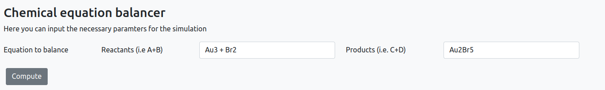
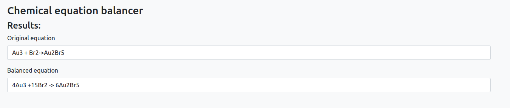

# Standalone app: Chemical balancer

## Description

The chamical balancer app is a Python application that allows usert to balance chemical reactions.
This app takes unbalanced chemical equations as input and generates the corresponding balanced equation as output.

## How ro run the app

### Inputs

When you open the app you will be presented by the following screen

On this screen, you will find the necessary fields to input the chemical equation you wish to balance. The interface provides the following sections:

- **Reactants**: Here, you can enter the chemical substances that act as the starting materials or reactants in the reaction. Simply input the relevant compounds or elements in this section.
- **Productsr**: This section allows you to input the chemical substances that are formed as a result of the reaction. Enter the products of the reaction in this field.

### Results

After processing the input, the app will present you with the results. The output will be displayed as follows:

- **Original equation**:This field displays the chemical equation you initially inputted, showing the unbalanced form of the reaction.
- **Balanced equation**:This field shows the balanced equation. The balanced equation accurately represents the stoichiometry of the reaction, with the appropriate coefficients for each compound or element.
