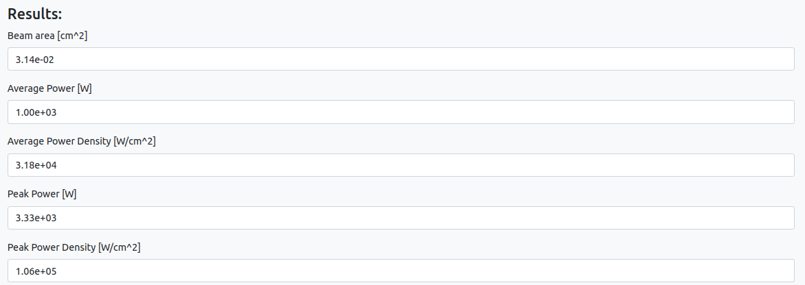

# Standalone app: Laser power

## Description

The Laser power app is a Python application that calculates various laser power-related parameters based on user input. It allows users to provide input values for frequency, beam diameter, pulse energy, and pulse width, and then computes and displays the corresponding power and power density values. The app also provides a plot of the laser power profile over time.

## How ro run the app

### Inputs

When you open the app you will be presented by the following screen

- **Frequency**: The frequency of the laser pulses.
- **Beam Diameter**: The diameter of the laser beam.
- **Pulse Energy**: The energy of each laser pulse.
- **Pulse Width**: The duration of each laser pulse.

### Results

#### Text

- **Beam area**: Area covered by the beam
- **Average Power**: Averaging the power over the course of one on/off cycle of the laser.This allows to determine the typical power output of the laser.
- **Average Power Density**: Average power divided by the size of the beam's area. This parameter provides insights into the power concentration within the laser beam.
- **Peak Power**:Energy of laser pulse divided by the pulse width.
- **Peak Power Density**: Peak power divided by the size of the beam's area. This parameter helps you understand the power concentration at the focal point or within a specific region of the laser beam.

#### Image

The app generates a diagram that illustrates the laser's power output over time. On the image a visual description of some quantities is reported

