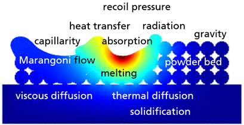
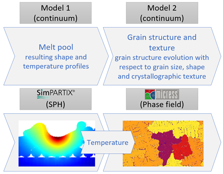
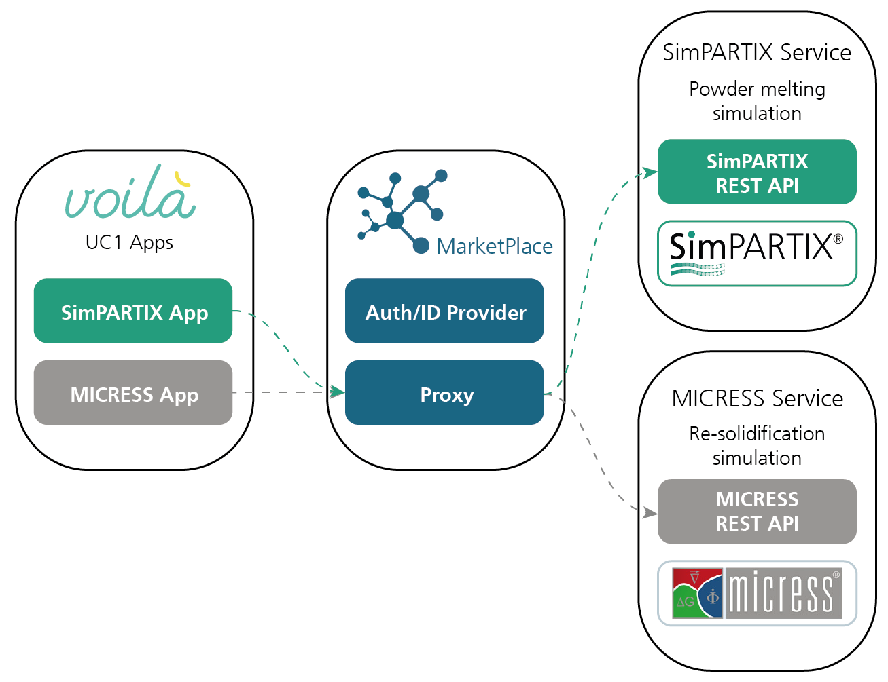
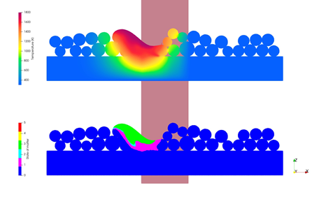
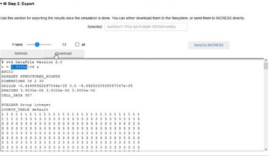
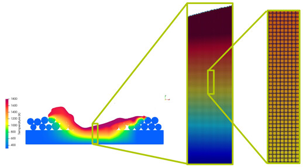
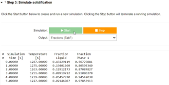
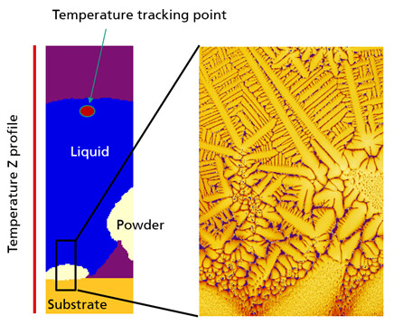

# Use Case 1 - Simulation of material properties from parts fabricated by Laser Powder Bed Fusion
 
This Use Case describes how simulations can be applied to predict the material properties of a fabricated part that have been produced by Laser Powder Bed Fusion process. In this process, one or more laser beams are used to create the three-dimensional structure to be built up in a powder bed by melting the powder particles.

## Motivation

Laser Powder Bed Fusion for Metals (LPBF) is an Additive Manufacturing technique that is continously integrated into the fabrication routes for new technical materials. One example for the need of such new materials is the engineering of the new generation of aero engines that need to reduce noise levels, CO2 emission and fuel consumption in order to comply with new EU regulations. The design of such materials, undoubtly, is complex and time-consuming. Simulations are an attractive tool to reduce the number of experimental tests by performing pre-tests numerically and then verify the simulations results experimentally. 

The complexity of some fabrication processes like LPBF and the occurance of many interacting physical phenomena (see Figure 1) therein, however, requires deep knowledge on the right choice of numerical models. Often, the methodology itself is  subject of ongoing research and, not surprisingly, a variety of simulation methods have been introduced to simulate the LPBF process. 

|  |
|:--:|
| <b>Figure 1 - Physical phenomena occuring during Laser Powder Bed Fusion</b>|

In many cases, there is no single encompassing model or software that is suitable to represent all physical phenomena at all length scales involved. Rather, a combination of different models and softwares is used where each software is optimized for one specific part of the process or one specific length scale. The usage of multiple softwares, however, requires to transfer data from one software to another and, in the case of different length scales, to extract a subsection from the previous simulation result. How such a coupling of two software, namely the commercial softwares SimPARTIX® from Fraunhofer IWM and MICRESS® from ACCESS, can easily be implemented in a sustainable manner is demonstrated in this Use Case 1. 

## Workflow

The workflow of this Use Case 1 consists of two models as shown in Figure 2. The workflow starts with a fluid dynamics simulation using the Smoothed Particle Hydrodynamics (SPH) method for the laser melting step. 
This simulation generates transient local temperature gradients as well as information on the evolution of the local thermodynamic state of matter (solid, liquid or gas) as an output. The full version of SimPARTIX® has been made available for this part of the workflow and additionally an interface to the software is created called SimPARTIX app through which the software can be operated. During the re-solidification of the previously melted material, the microstructure is created by the growth of crystalline grains within the metallic alloy. The distributions of size, shape and orientation of the grains ultimately determine the mechanical properties of the additively manufactured component. The emergence of crystalline structures during solidification is modelled by using the phase field (PF) method which takes the temperature profiles from the SPH simulation as input. 
MICRESS is used for this part of the workflow, and similar to SimPARTIX, has been made available via an interface called MICRESS app.

|  |
|:--:|
| <b>Figure 2 - Use Case 1 consists of two continuum models that are provided by SimPARTIX and MICRESS</b>|

The current workflow of Use Case 1 on MarketPlace consists of the SimPARTIX and MICRESS simulation apps both of which can be accessed via a Jupyther Notebook (Voila). These apps communicate with each other through the MarketPlace server via RESTful APIs with the SimPARTIX and MICRESS web services. Details are depicted in Figure 3. The MarketPlace is handling the full authorization and keeps track on which licenses are available to the user. 

|  |
|:--:|
| <b>Figure 3 - Established workflow for the communication among SimPARTIX and Micress through the MarketPlace</b>|

### Input parameters for the SimPARTIX app

The magnitude of physical phenomena involved in this process leads to a high number of model parameters. For the sake of simplicity, this Use Case 1 uses the material data for the nickel-based allow Inconel 718 and limits the number of adjustable parameters to the following five parameters:

* Laser power (W) 
* Laser scan speed (m/s) with which the laser traverses the powder bed
* Powder volume fraction (-) to describe the initial filling density of the powder
* Powder layer thickness (m) which is the height of the powder layer. 
* Particle diameter (m). In this tutorial, all particles will have the same diameter. 

All these parameters can be provided with the help of the sliders shown in Figure 4.

|  |
|:--:|
| <b>Figure 4 - Available input parameters for the SimPARTIX app</b>|

The simulation is started by clicking on the "Submit" button. A screenshot from the exemplary simulation is shown in Figure 5. The powder bed is color-coded according to the local temperature field. Upon activation of the laser, the powder starts melting and shows viscous flow behavior until solidification. The bottom image shows the current state of matter where blue means solid matter, pink means solidified again after having been molten and green means that the powder is still in a molten state. 

|  |
|:--:|
| <b>Figure 5 - Exemplary screenshot for the powder melting simulation</b>|

After the simulation has finished, the calculated aggregate states and temperature fields can be converted into the data format VTK that is required by MICRESS. This conversion can be initiated by clicking on the "Convert" button as shown in Figure 6. This step will use the simulation results from SimPARTIX and convert them into a VTK file which is the file format that is required by MICRESS. In this stage, the user can choose a so called "Frame" from which the data is used for the conversion. This "Frame" is a variable that is used to describe the progress of the simulation. Here, the first frame (Frame = 0) is the beginning of the simulation while the last frame is the end of the simulation. By using any other frame than the last frame, it is possible to select another point in time of the simulation. 

|  |
|:--:|
| <b>Figure 6 - Initiating the conversion of the SimPARTIX result for the MICRESS simulation</b>|

The details of the coupling between SimPARTIX and MICRESS is shown in Figure 7. The powder bed on the left is color coded according to the local temperature. From this temperature field, a small section is extracted. Here, we choose a part that is directly affected by the melt pool, i.e. a part that has experienced a strong variation in temperature during melting and solidification and hence is of interested for the formation of the local microstructure. From this part, we define a fixed windows out of which we read out the temperature history. 

|  |
|:--:|
| <b>Figure 7 - Illustration on how a subsection of data is used for conversion</b>|

### Input parameters for the MICRESS app

After the conversion, it is possible to initiate high-resolution phase field simulation with MICRESS. The underlying data for this simulation is stored on the MarketPlace server and is directly available to MICRESS. Similar like for the SimPARTIX App, there are input parameters available for the simulation (Figure 8) that in this case are:

* the initial temperature (K) of the part
* the temperature gradient (K/µm) along the part
* the cooling rate (K/s) with which the part is cooled to room temperature

|  |
|:--:|
| <b>Figure 8 - Input parameters for the MICRESS simulation</b>|

Finally, the actual simulation is executed by clicking on the "Start" button as shown in Figure 9. 

|  |
|:--:|
| <b>Figure 9 - How to start the MICRESS simulation</b>|

The progress of the simulation can be monitored within the app as shown in Figure 10. The crystals are growing from the bottom substrate upwards as indicated by the yellow region. The blue part is still liquid part that still has to solidify. 

|  |
|:--:|
| <b>Figure 10 - Exemplary part of the MICRESS simulation that shows the growth of crystals.</b>|

## How to apply the workflow

To apply the full workflow, a license for both softwares SimPARTIX and MICRESS need to be purchased. 

