# The UC2 app – Paste levelling

Use case 2 involves simulating viscoelastic pastes used in screen printing for solid oxide fuel cells
with the objective to develop a simulation workflow to examine numerically the impact of paste properties
on the printed image to evaluate its quality.
The screen-printing process consists of several steps, shown in Figure 1. The first part of the process
comprises the mesh filling (steps 1 – 3), followed by the printing step (step 4), where the paste is
transferred to the substrate. The last step describes the levelling (step 5), where the material flow
gradually stops resulting in the final structure (surface waviness and line width).

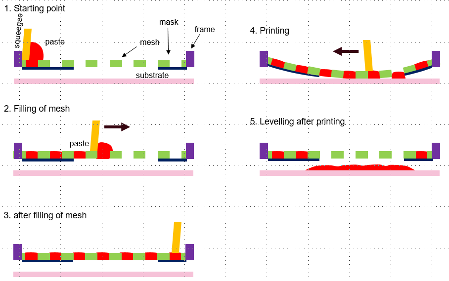
**Figure 1**: _Description of the screen printing process._

The viscoelastic material in question is highly complex, exhibiting nonlinear behavior. Simulating each step of the process incurs significant computational costs. Consequently, the application exclusively focuses on the levelling stage of screen printing. The levelling stage plays a crucial role in determining the final print quality by influencing the spread of the paste, an essential parameter.
The spread of the paste is heavily influenced by its properties. Therefore, simulating the levelling process is ideal for testing different pastes and identifying their optimal properties while minimizing the need for extensive experimentation.
The Paste Levelling App requires input files containing experimental rheometer data for various pastes. It outputs a measurement of paste broadening and provides comparison plots between experimental and simulated rheometer data as intermediate results.

## Description of the workflow

### 1: Parameter estimation

Experimental rheometer data for a certain paste is taken as input for a parameter optimization script,
which uses the Giesekus model equations to determine the constitutive properties required for the simulation.

### 2: Rheometer

---

The second step is a simulation of the rheometer. The constitutive properties from the parameter optimization
are used in an OpenFOAM simulation with rheotools, where the rheometer is simulated and the results are compared
with the experimental data for validation of the obtained constitutive properties.

### 3: Paste settling

---

Finally, the same constitutive properties are used for a full multiphase simulation of paste levelling, which is
allowed to settle under gravity for the measurement of its spread.

## Description of the app

The Paste Levelling Application streamlines the workflow discussed in the previous section by automating
the three steps without requiring any user input between them. The application is illustrated in the figure
below and is built using a series of Python modules to handle the different stages of the workflow.

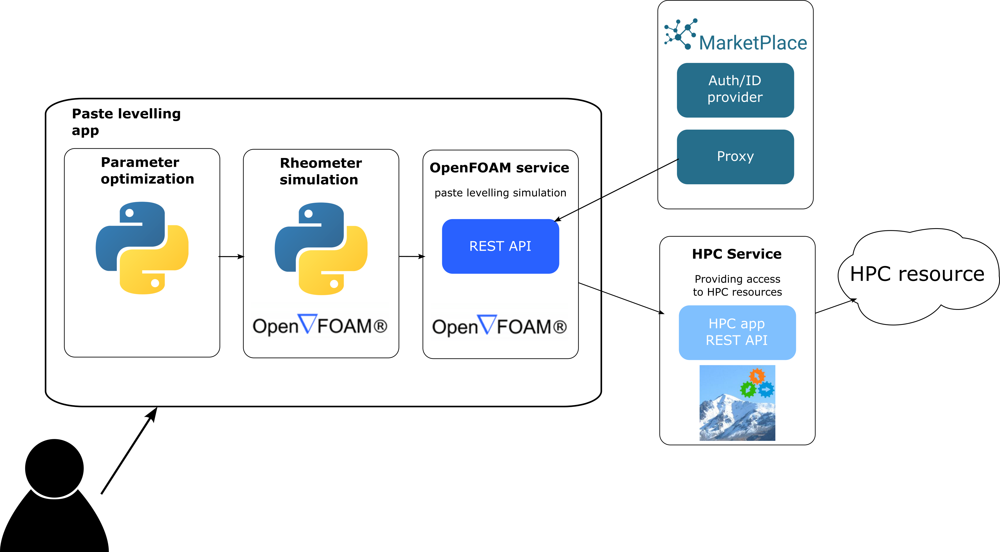
**Figure 2**: _Sketch of the app workflow._

The app consists internally in a series of Python modules which handle the different steps of the workflow.

### Parameter optimization

The first step, parameter optimization, generates the output with the constitutive properties used in the OpenFOAM
simulations of both the rheometer and levelling steps.

### Rheometer simulations

The rheometer simulations are performed using a Python script that carries out a series of OpenFOAM simulations over the required
range of frequencies and amplitudes to replicate the experimental rheometer data.
In this step, we evaluate the ability of the Giesekus model, with parameters obtained in the previous step, to reproduce paste moduli and viscosity.

### Simulation

Finally, the levelling simulation is a pre-prepared OpenFOAM case setup that requires only the appropriate constitutive properties to run.
This step uses a REST API to communicate with the MarketPlace platform and the HPC app, which handles the parallel remote job.

The graphical user interface is handled via Flask, a Python-based web application framework.

## How to run the app

When you open the app you will be presented with the following screen

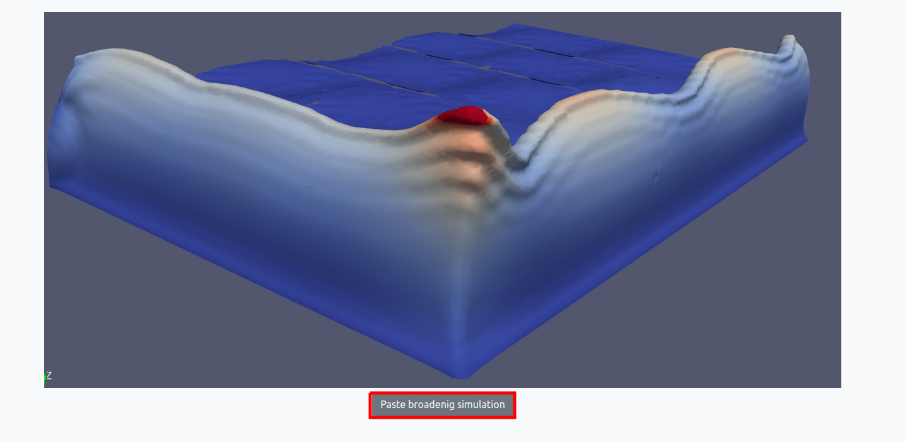

To begin using the app, click on the "Paste broadening simulation" button.

### Preparation

You will be presented the app interface where you can enter all the quantity you need for your case.

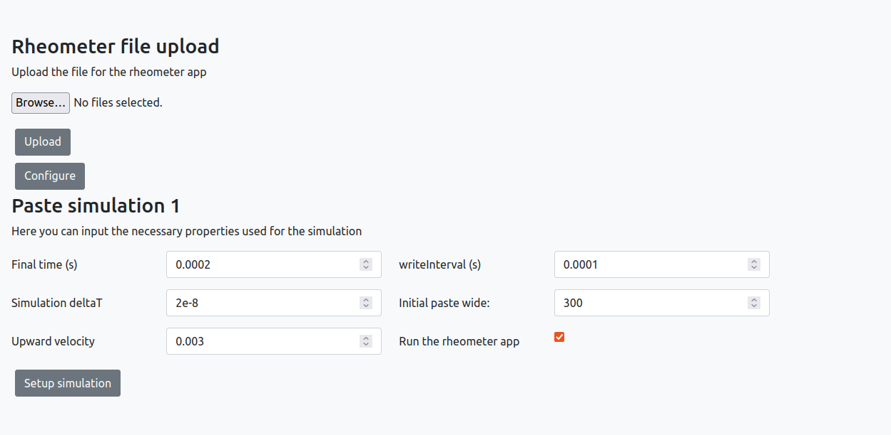

### Loading experimental data

The first step is to upload the experimental data in the upper part of the screen and click on Configure

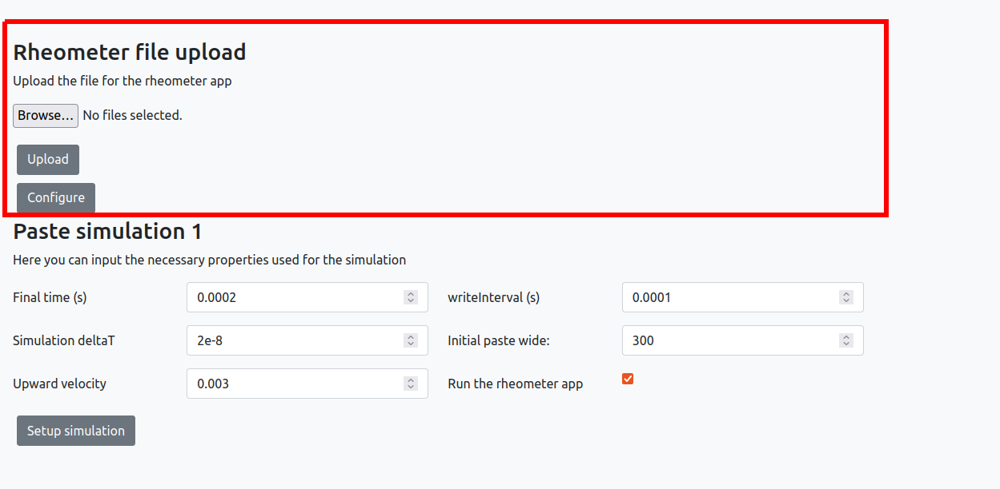

### Simulation parameters

In the lower part of the screen you need to define the simulation parameters.

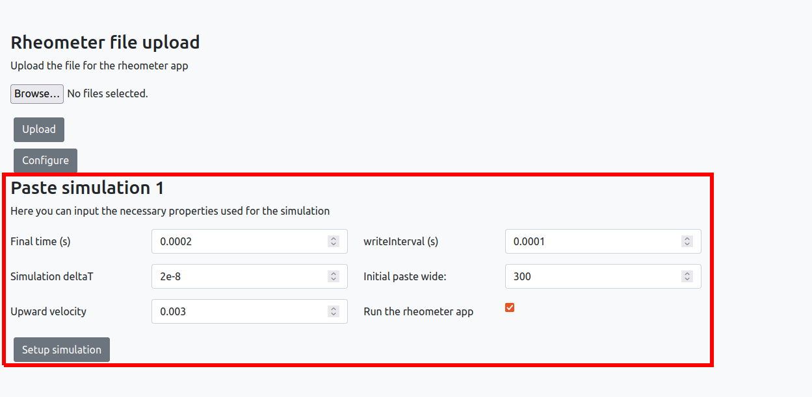

The parameters are described in more detail below:

- **Final time**: This parameter sets the duration of the simulation, starting from time 0. The simulation will run until the final time is reached.
- **Simulation deltaT**: his parameter sets the time step used in the simulation. A smaller time step will result in a more accurate simulation, but will require more computational resources.
- **Upward velocity**: This parameter sets the upward velocity induced by the grid being lifted. The velocity is depicted in the figure below, and is a key factor in the rheometer simulation.
- **writeinterval**: This parameter determines how often the simulation values will be saved. It must be larger than the time step.
- **Initial paste wide**: This parameter sets the initial size of the deposed paste. This is also depicted in the figure below, and is an important input for the simulation..
- **Run the rheometer app**: This option determines whether or not to run the parameter estimation and rheometer steps of the application. If left unchecked, the paste broadening app will run with default values.

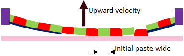

Once everything is set, you can click on the `Setup simulation` button.

### Running

A screen summarizing the simulation settings will appear, along with an option to run the simulation:

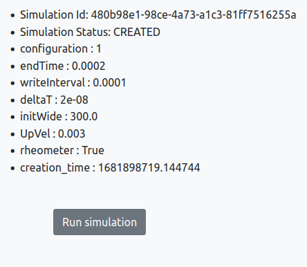

when you click on the _Run simulation_, you will see the _Simulation Status_ change from _CREATED_ to _INPROGRESS_

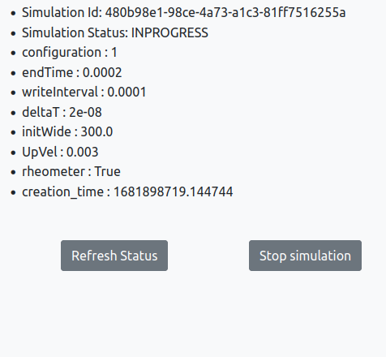

click on the _Refresh status_ button, until the _Simulation Status_ change from _INPROGRESS_ to _COMPLETED_,

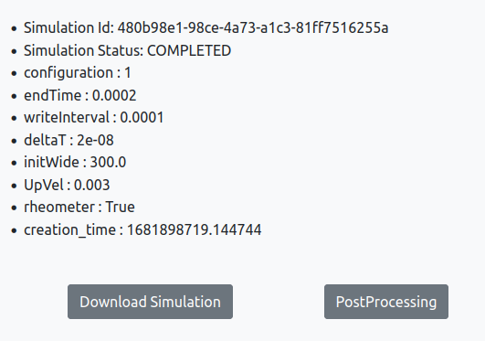

### Results

When a simulation is completed you will be offered two option, _Dowload Simulation_ or _Postprocessing_

#### Download results

If you click on _Dowload Simulation_, you will see the screen below, which allows you to dowload the simualtion data and results.

#### Postprocessing

To access the default post-processed results, simply click on the "Postprocessing" button, as shown in the image below.

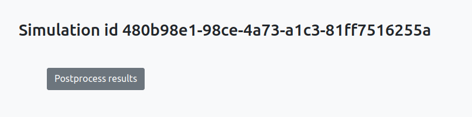

Once you've clicked on "Postprocess results," you will see a screen that looks similar to the one below:

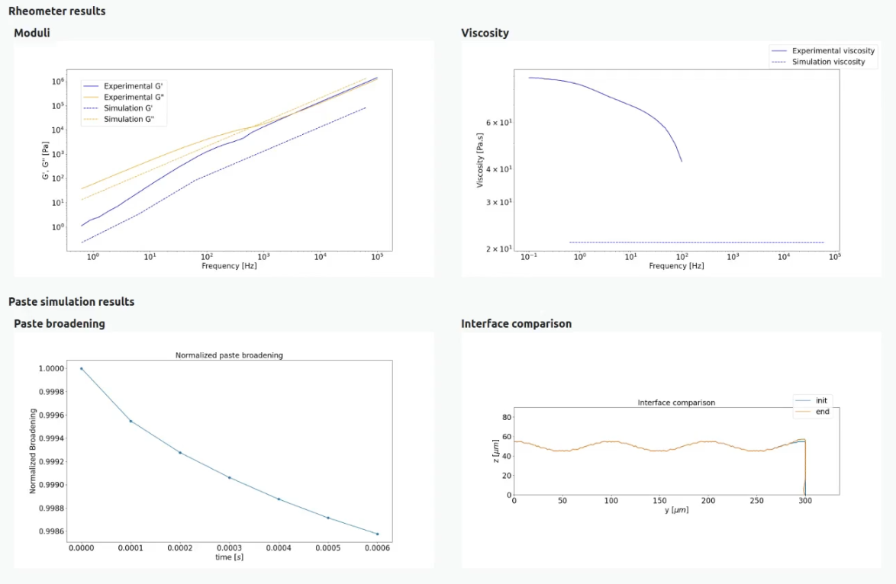

The resulting plots are described in more detail below:

- **Rheometer results** This section shows a comparison between numerical and experimental rheometer data

  - **Moduli**: This plot compares G' and G''.
  - **Viscosity**: This plot compares viscosity.

- **Paste simulation results**: This section displays the results from simulation.
  - **Paste broadening**: This plot shows the time evolution of the normalized paste broadening, which is calculated by dividing the paste width at time t by the initial width value.
  - **Interface comparison**: This plot compares the initial interface, with the interface at the end of the simulation.
