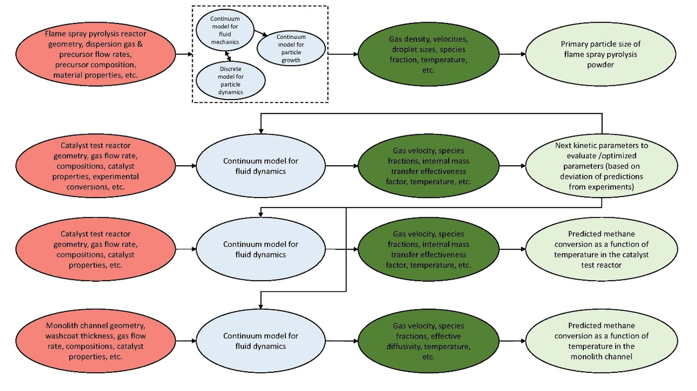
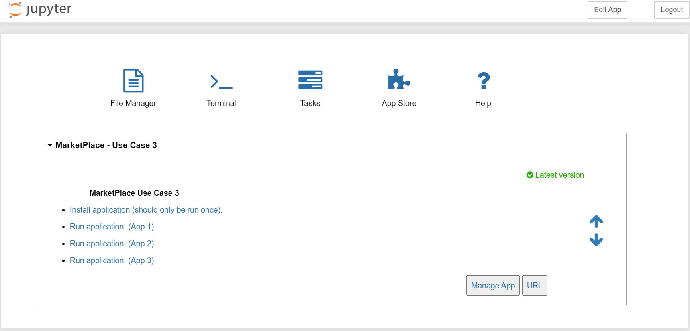
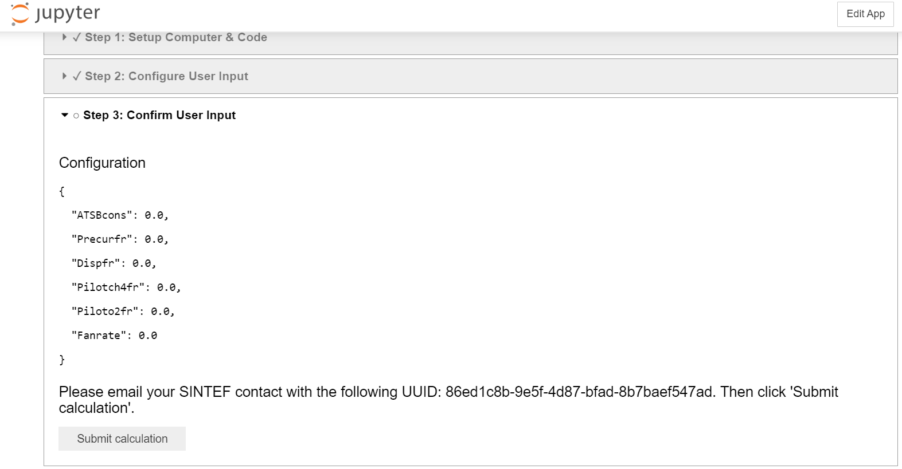
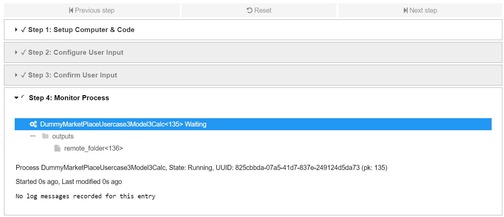
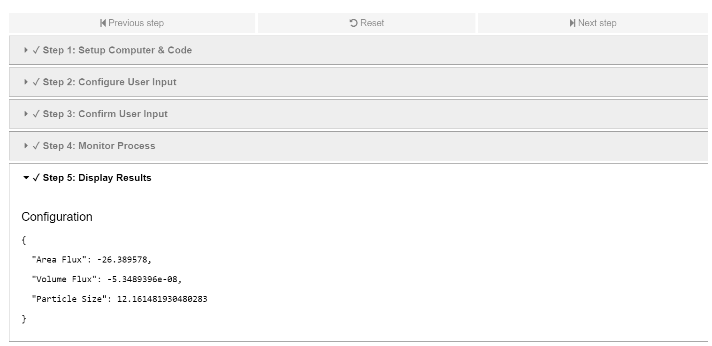

# Use Case 3 – Methane oxidation catalyst testing

The intention of the apps developed in use case 3 (UC3) of the MarketPlace project is to accelerate the development and testing of catalysts for methane oxidation using flame spray pyrolysis materials as catalyst supports. Four different apps were developed as part of the use case, as shown in the MODA diagram below. The apps can be used individually, or as part of a workflow as indicated in the MODA.

_MODA diagram of the UC3 app workflow_

## Flame spray pyrolysis (FSP) app - App 1

The purpose of the FSP app is to allow an FSP operator to assess how changing the many operating parameters of the reactor (e.g. dispersion gas flow rate, precursor composition and flow rate, fan extraction rate, etc.) will affect the primary particle size of the powder that is produced, which determines its performance when used as a catalyst support. For the FSP app, a computational fluid dynamics (CFD) model using ANSYS Fluent is employed which tightly-couples a continuum model for the gas flow to a discrete model for the precursor spray. In addition, the continuum model for the gas flow is one-way coupled to another continuum model which solves the evolution of the particles through nucleation, agglomeration and sintering using a population balance model. Some example simulation outputs are shown in below.

_Predicted averaged primary particle diameter for five different operating conditions of a FSP reactor (left) and temperature contour plots (right, blue = 300 K, red = 3300 K) for the corresponding conditions (plots not generated in the app)_

## Catalyst kinetics calibration app - App 4

Many catalyst developers use experimental rigs where a small catalyst sample in a packed bed is tested under different operating conditions. These rigs are good for high throughput testing of different catalysts, but not for extracting detailed reaction kinetic data due to several non-ideal effects. For catalytic methane oxidation, the most important effects are the large exotherm due to the highly exothermic reaction, rapid heat loss from the small reactor and internal mass transfer limitations due to rapid reaction at higher temperatures. Considering this, the purpose of the Catalyst calibration app is to allow the extraction of (as close as possible to) intrinsic kinetics from such a reactor. Kinetic parameters determined in this way will be more robust in simulations performed at conditions that differ from those where the kinetics were derived. To achieve this, the kinetic parameters are obtained by calibrating the parameters against experimental data directly in a CFD continuum model (using ANSYS Fluent) which accounts for the above-mentioned non-ideal effects. In the app, curated experimental data is obtained through an interface to ANSYS Granta MI. The optimization workflow is run using ANSYS optiSLang. Due to the use of propietory software, the app is currently not integrated into the MarketPlace platform, but the optimal kinetic parameters obtained from the app is available as default settings in the subsequent apps.

## Catalyst test reactor app - App 2

The purpose of Catalyst test reactor app is to allow an experimentalist to assess and better understand the detailed physical behaviour of their tests, once the reaction kinetic parameters are obtained for a specific catalyst from the Catalyst kinetics calibration app. For example, the user can assess whether significant internal mass transfer limitations are present for the size of the catalyst pellets used in the test, or if high temperatures that may lead to sintering are found locally. For this purpose, the same continuum model of the catalyst test reactor is used as in the Catalyst kinetics calibration app, only now using known reaction kinetic parameters as input.

## Monolith channel app - App 3

Finally, the Monolith channel app is intended to allow a catalyst developer to assess, from simulations, the performance of their catalyst in the intended final application in a washcoated monolith. The only required input is experimental data regarding the catalyst performance in the catalyst test reactor. This is beneficial, since the tests performed in the catalyst test reactor are much faster and less expensive than performing experiments using a washcoated monolith. To achieve this, a continuum CFD model was developed in ANSYS Fluent for a washcoated monolith channel, using the kinetic parameters obtained in the Catalyst kinetics calibration app as input. The model considers the heat generated by the exothermic methane oxidation reaction and internal mass transfer limitations by solving the effective diffusivity in the washcoat. Some example simulation outputs are shown below (plots not generated in the app).

_Left-hand side: simulation-predicted methane mole fraction at a channel cross-section near the inlet: blue – 0 % CH4, red – 1 % CH4. Right-hand side: Predicted light-off curves for different catalyst palladium loadings._

## UC3 System User Guide

This guide will walk you through the process of using the UC3 system, from installing AiiDA to running applications.

### Section 1: Installation and Setup

To start, you'll need to install AiiDA and set up the system. The following figures illustrate the steps you should follow.

_The AiiDAlab homescreen_

The next step is to select and upload your SSH key.

_Selecting the SSH key_

Finally, you'll need to install AiiDA and set up the system.

_Installing AiiDA and setting up the system_

### Section 2: Running Application 1

Running Application 1 involves selecting the code and computer, inputting parameters, confirming the inputs and sending the UUID via email, and finally viewing the results.

_Selecting the code and computer for Application 1_

Next, select the inputs for the calculation.

_Selecting inputs for Application 1_

Confirm the inputs and make note of the UUID that you will need to email to the controller.

_Confirming inputs and noting the UUID_

Monitoring the calculation.

_Viewing results for Application 1 in JSON format_

Finally, view the results in JSON format.

_Viewing results for Application 1 in JSON format_

### Section 3: Running Application 2

The steps for running Application 2 are similar to those for Application 1, but instead of a JSON output, you will receive a figure.

_Viewing results for Application 2_

### Section 4: Running Application 3

Finally, running Application 3 is almost identical to running Application 2. The following figure illustrates the results you should expect.

_Viewing results for Application 3_
