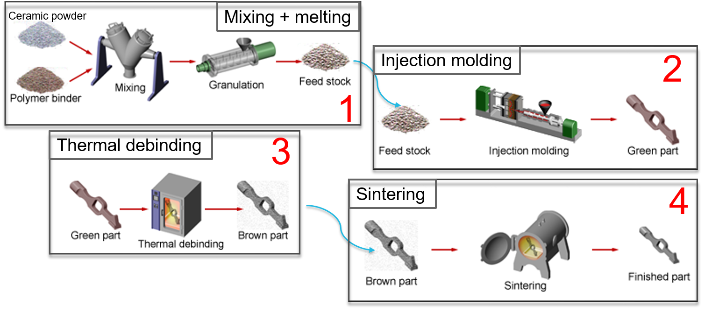
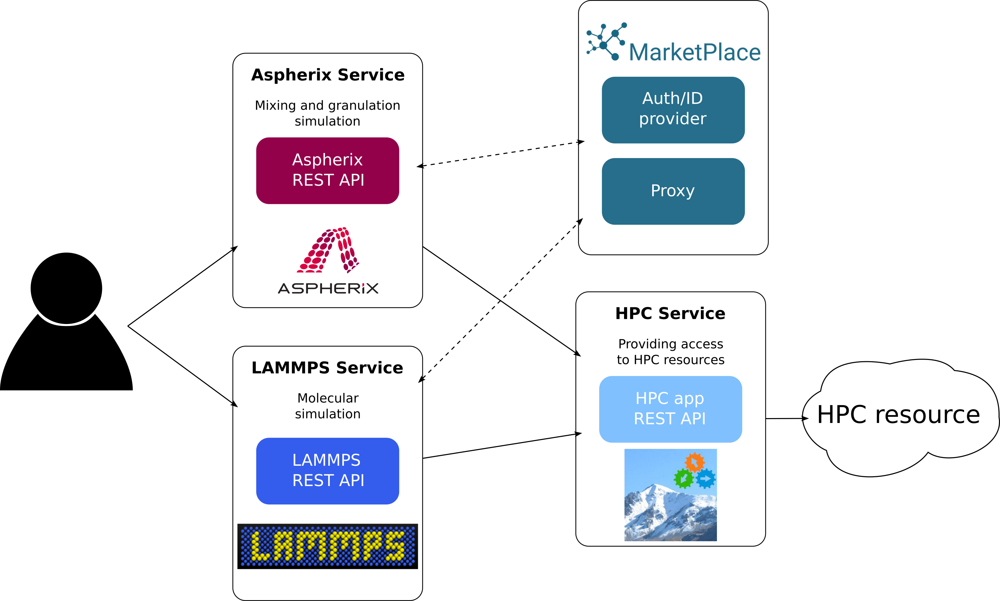
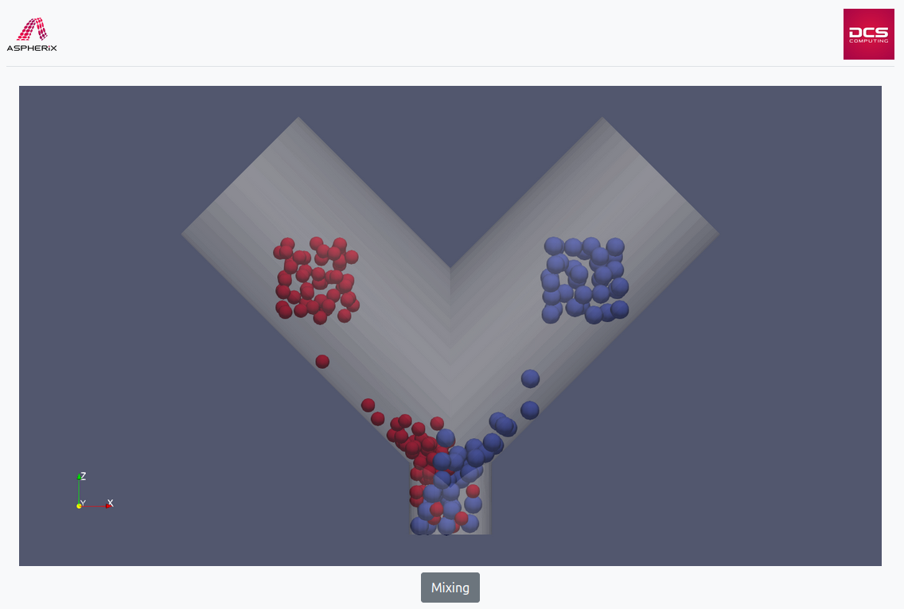
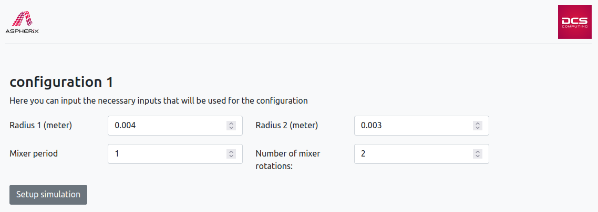
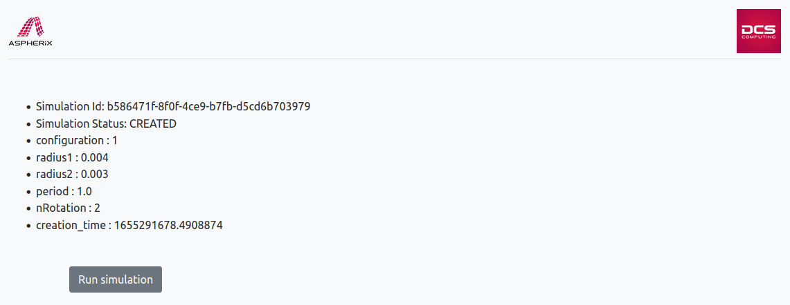
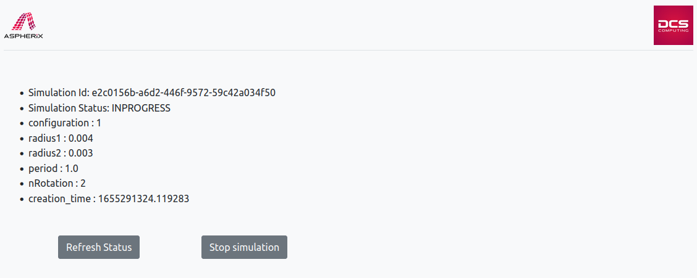
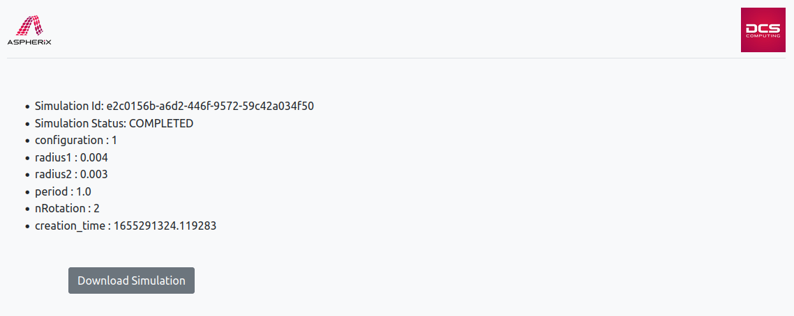
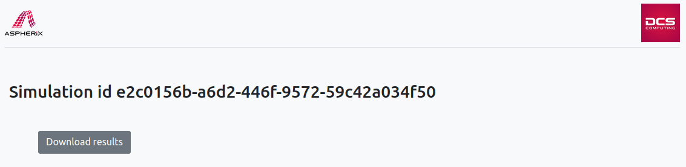

# The UC4 app – Injection moulding for medical applications

Use case 4 involves simulating and multi-step simulation of the mixing, granulation
and sintering process for medical applications. The final objective of the workflow
is the simulation of a dental implant that are indicators of the material performance.

**Figure 1**: _Overview process from mixing to sintering._

The app consists of several subsequent steps where each one requires some user input. Currently, for development and legal reasons the workflow is split up into separate apps, thus the user has to provide output information from one app to the next one.

## Description of the workflow

### 1: Mixing and granulation

Two components (ceramic powder and polymer binder) are mixed and granulated to produce the feed stock.

### 2: Data transition

Manual step to transform Asperhix output information (particle size distribution) into an Lammps data file.

### 3: Melting

Atomistic simulation with Lammps in order to extract input parameters for the final simulation of the injection flow.
Those include parameters for the viscosity and PVT-behavior constitutive models of the investigated composite, which serve as input during the material definition in many commercial injection molding simulation software, such as Sigmasoft® Virtual Molding and Autodesk Moldflow®.

### 4: Injection flow

Finally, the continuum simulation can be run externally to investigate the material performance.

## Description of the app

The Injection moulding application consists of several standalone apps that must be used subsequently. As shown below all apps, Aspherix and Lammps, use Marketplace for authentication and HPC App for managing the hardware resources.

**Figure 2**: _Sketch of the app workflow._

### Aspherix

The first step, mixing and granulation is performed by the DEM simulatino engine Aspherix. The user input is translated into the correct engine input. The simulation results can be downloaded after finishing the simulation.

### Lammps

The modified Aspherix output is used as Lammps input data. The simulation results are then converted by a packaged python workflow into a set of material parameters for injection molding simulation software.

### External tools

As mentioned above two additional tools are required for data transistion between Aspherix and Lammps as well as Lammps and the injection molding simulation software.
Currently, the user must run both tools locally.

## How ro run the Aspherix-app

When you open the app you will be presented by the following screen

To begin using the app, click on the "Mixing" button.

### Simulation parameters

On the next page you need to define the simulation parameters.

The parameters are described in more detail below:

- **Radius 1**: Radius of first particle group. (Ceramic)
- **Radius 2**: Radius of second particle group. (Polymer)
- **Mixer period**: Period for one full rotation of the mixer.
- **Number of mixer rotations**: Number of full rotations of the mixer that should be simulated. This defines the total simulation duration.

Once everything is set, you can click on the `Setup simulation` button.

### Running

A screen summarizing the simulation settings will appear, along with an option to run the simulation:

when you click on the _Run simulation_, you will see the _Simulation Status_ change from _CREATED_ to _INPROGRESS_

click on the _Refresh status_ button, until the _Simulation Status_ change from _INPROGRESS_ to _COMPLETED_,

### Results

When a simulation is completed you will be offered to download the results via _Dowload Simulation_.

#### Download results

If you click on _Dowload Simulation_, you will see the screen below, which allows you to dowload the simualtion data and results.

