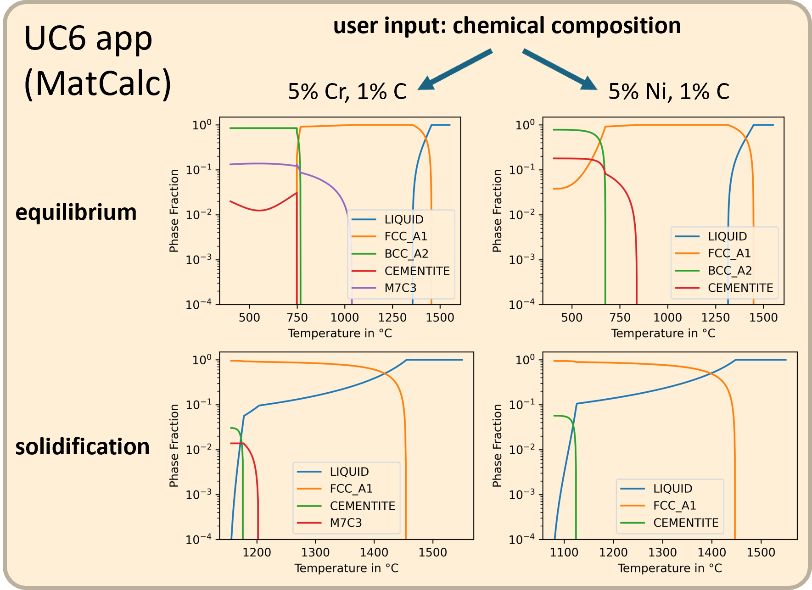

# The UC6 app – MatCalc

Parts produced by laser cladding and laser metal deposition techniques require a balanced trade-off between hardness and strength. Therefore, the experimental effort for the development of customized steel powder is usually very high. This use case aims at reducing the experimental effort by thermodynamic calculations.

Dependent on the alloy composition and cooling rate, the material forms complex microstructures. Usually, there is a high volume fraction of martensite or bainite due to the high cooling rate. Furthermore, a certain volume fraction of retained austenite may be present. The stability window of austenite and compositional differences between austenite and ferrite as well as primary and secondary austenite (“primary”: solidified as austenite, “secondary”: solidified as δ-ferrite and transformed to austenite) can be estimated. Besides, various carbides and intermetallic phases may precipitate. The UC6 app uses MatCalc ([matcalc.at](https://www.matcalc.at)), which is developed at Vienna University of Technology, Graz University of Technology and Materials Center Leoben, to evaluate the underlying thermodynamics.

The MatCalc App allows an easy evaluation of the thermodynamic equilibrium and the thermodynamics during solidification. In order to make the use case accessible to a wide user group, the free version of MatCalc is used. Both the software and the required thermodynamic database can be freely used. However, since the free version is limited to three chemical elements, a system consisting of iron, carbon and one additional metal, e.g., chromium, manganese, or nickel, is considered. The app enables the user to easily assess the system without any knowledge of thermodynamic calculations and MatCalc. The same approach is applicable to the full license version, enabling a wider range of elements to be included.

**Figure 1**: *The MatCalc app calculates the phase fractions in thermodynamic equilibrium (top) and during solidification (bottom). The results depend on the alloy composition, e.g. Fe-Cr-C (left) or Fe-Ni-C (right).*

As a first step, the user selects one alloying element from the options Cr, Mn, Mo, Ni, and Si. After defining the weight percentages C and the other alloying element (balance is Fe), the app calculates the phase fractions of the stable phases in equilibrium as well as their composition as a function of temperature (**Figure 1**, top). In the next step, the app carries out a Scheil-Gulliver calculation to simulate solidification. Starting from the liquid range, the temperature is decreased, and the evolution of the solid phases is calculated until all liquid has solidified (**Figure 1**, bottom). The resulting phase fractions and the composition of the phases after solidification are relevant for the microstructure evolution during further cooling.

Although additive manufacturing is a non-equilibrium process, considering the equilibrium phase diagram provides useful preliminary information. MatCalc cannot directly predict some key features of microstructure evolution, e.g., the martensitic or bainitic transformation. However, the partition of the elements during solidification affects the transformation kinetics. Therefore, the Scheil-Gulliver calculation provides valuable information about what kind of final microstructures can be expected.
