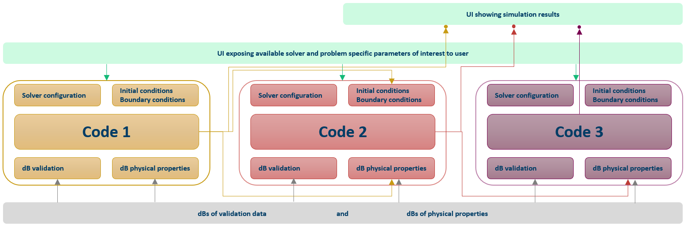
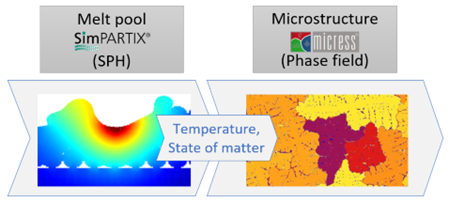
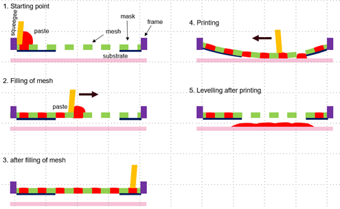
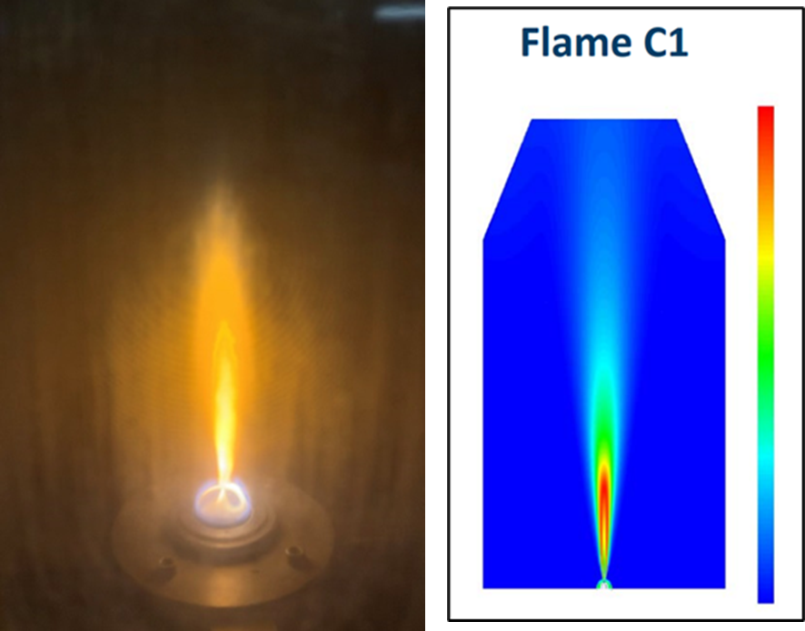
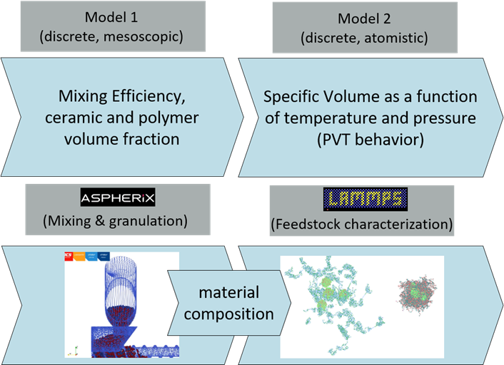
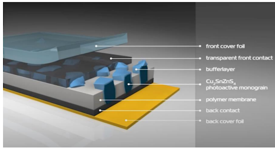
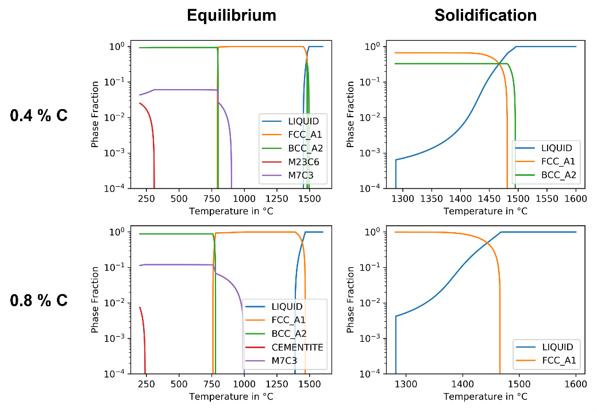

# Use cases

To demonstrate industrially relevant use of the MarketPlace platform a total of six use cases were developed. These were:

- [Use case 1](./uc1): **Laser powder bed fusion L-PBF** .
- [Use case 2](./uc2): **Screen printing of solid oxide fuel cells** .
- [Use case 3](./uc3): **Nano-particle production and catalyst testing** .
- [Use case 4](./uc4): **Ceramic injection moulding for medical applications** .
- [Use case 5](./uc5): **Printing of Photovoltaic Thin Films** .
- [Use case 6](./uc6): **MatCalc demo** .

Implementation details for each use case can be found by clicking the individual links.

All use cases, except the last, consist of at least two independent software programs where the output from one program forms part of the input to the second program.
The software programs/tools used are all general purpose programs which can to some extent be customized and adopted further.
Ideally, every relevant state or models would be syntactically described and accessible through an open API.
However, this is rarely the case, and some cases may need bespoke customization to solve a particular problem.
Thus, it would be a formidable task to expose the entire user accessible/modifiable user interface.
Instead the approach taken at this stage in the MarketPlace platform development is for experts to set up and configure these solvers for each solver in the use cases.
For tested and validated use cases the end user is presented with a set of relevant parameters that can be changed by the user through a RestAPI.
This is illustrated in schematic below where three codes are executed in series with all three codes contributing to the output layer:



Below we give a more prosaic overview of each of the use cases.

| UC  | Description                                                        | Partners                                         | Illustration                                      |
| --- | ------------------------------------------------------------------ | ------------------------------------------------ | ------------------------------------------------- |
| 1   | Laser powder bed fusion for additive manufacturing of super-alloys | MTU, Fraunhofer, ACCESS, ANSYS-Granta, EPFL      |  |
| 2   | Screen printing of solid oxide fuel cells                          | Bosch, DCS, ANSYS-Granta                         |  |
| 3   | Nano-particle production and catalyst testing                      | Johnson Matthey, Lurredera, SINTEF, ANSYS-Granta |  |
| 4   | Ceramic injection moulding for medical applications                | HES, DCS, ANSYS-Granta                           |  |
| 5   | Printing of Photovoltaic Thin Films                                | Crystalsol, UCL                                  |  |
| 6   | MatCalc demo                                                       | MBN, Fraunhofer                                  |  |

```{toctree}
:hidden: true
:maxdepth: 2

uc1
uc2
uc3
uc4
uc6
```
